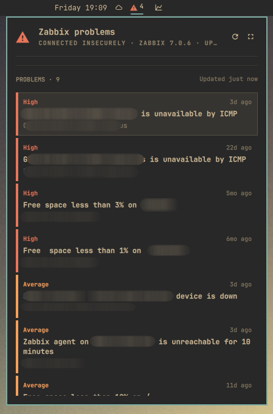
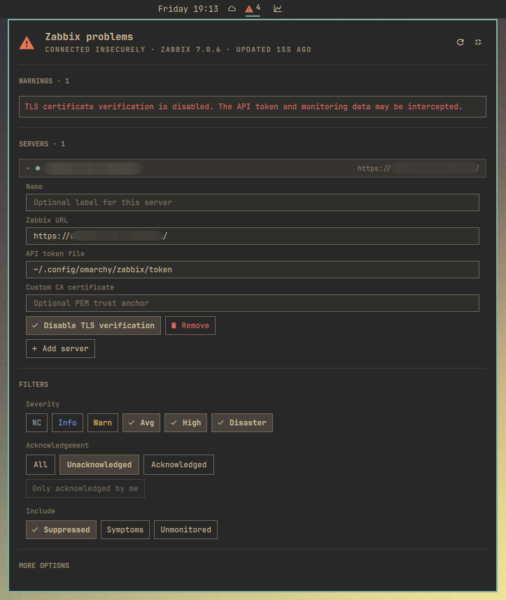

# Zabbix Problems for Omarchy

`dechnik.zabbix` is an Omarchy Quattro bar widget for unresolved Zabbix
trigger problems, from one server or several. It keeps the most severe visible
state in the bar and opens a read-only, server-, severity- and
acknowledgment-filterable problem list with host names, age, acknowledgment,
and suppression state. Servers are added and edited in the panel itself.



Collapsed, the panel is only the header and the problem list — nothing competes
with problems for space.



Expanded (the header button, or `e`), it adds warnings, the server editor, the
filters, and the refresh interval above the still-visible problem list. The
`Server` filter group appears alongside `Severity` once a second server is
configured; with one, as here, there is nothing to choose between.

## Bar Summary

The bar number is deliberately **not the total problem count**. From the
retrieved problems that match the selected server, severity, and acknowledgment
filters, the plugin finds the highest numeric severity and counts only problems
at exactly that severity. Lower-severity problems are not added. With several
servers configured the highest severity is taken across all selected ones, so
the bar shows the worst thing happening anywhere.

Only problems the Zabbix frontend would show are counted. `problem.get` keeps
reporting problems whose trigger has been disabled or whose host is no longer
monitored, and on a long-lived install those dominate: one real server reported
228 problems, of which 65 were live. The plugin resolves every problem's
trigger through `trigger.get` with `monitored`, and drops the rest unless
`showUnmonitored` is on.

The count is also exact rather than a side effect of how many problems were
fetched. `problem.get` cannot sort by severity, so asking for "the newest
`problemLimit`" would silently drop older high-severity problems. The plugin
ranks the complete live set itself and fetches detail only for the survivors.

For example, one Disaster, three High, and seven Warning problems produce a red
Disaster icon and `1`, not `11`. Four High problems with nothing at Disaster
produce a High icon and `4`. A successful result with no matching problems
shows a neutral `0`; no successful result yet shows a neutral `?` instead of a
false healthy zero. A truncated result can make the displayed count incomplete,
and so can a server that has not answered — that case keeps the count from the
servers that did and marks it stale rather than falling back to `?`.

## Requirements

- Omarchy Quattro with third-party shell plugin support
- `curl`
- One Zabbix 7.0 or newer frontend/API endpoint reachable over HTTPS
- A Zabbix API token with the read access described below

The configured URL may be the frontend root, such as
`https://zabbix.example.com/zabbix`, or the full
`https://zabbix.example.com/zabbix/api_jsonrpc.php` URL. HTTP URLs, embedded
credentials, queries, and fragments are rejected.

## Install

Install the Git repository and enable its bar widget in one step:

```bash
omarchy plugin add https://github.com/dechnik/omarchy-zabbix.git --enable
```

Or install first and enable later in the default right section:

```bash
omarchy plugin add https://github.com/dechnik/omarchy-zabbix.git
omarchy plugin enable dechnik.zabbix --section right
```

Move it later if desired:

```bash
omarchy bar move dechnik.zabbix --section right
```

Omarchy warns before installing because third-party plugins execute
unsandboxed inside `omarchy-shell`. Review repositories before enabling them.

## Zabbix Access

Create the token for a dedicated, read-only Zabbix user where practical. An API
token inherits its owner's user type, role, user-group permissions, and host
visibility; the token does not have an independent permission set.

The minimum role/API setup is:

- Enable **Access to API** for the token owner's role.
- Permit `problem.get` and `trigger.get`. If the role uses an API-method Allow
  list, add both exact methods. If it uses a Deny list, do not deny them.
- Permit `user.checkAuthentication` **only if** you use the *only acknowledged
  by me* filter. The plugin calls it once per endpoint and token to learn the
  token owner's user id, which `problem.get` then uses as `action_userids`. The
  call is unauthenticated — the token travels in the request body, not the
  `Authorization` header. If the method is denied, the refresh still succeeds:
  the panel shows a notice and lists problems acknowledged by anyone rather than
  silently hiding other people's work.
- `apiinfo.version` is only available to unauthenticated callers. The plugin
  calls it without the token before its first authenticated request, so it is
  not a permission that can or needs to be granted to the token's role.
- Any Zabbix user type can call `problem.get` and `trigger.get` unless its role
  revokes those methods. No create, update, acknowledge, suppress, or close
  method is needed.
- Give the token owner's user groups at least read visibility to the host
  groups whose problems should be shown.

Zabbix applies normal object visibility to API results. The plugin therefore
shows only problems and trigger/host context visible to the token owner; it
cannot distinguish an invisible object from one that does not exist. A problem
whose trigger enrichment is absent remains listed as `Hosts unavailable`.
Denial of the entire `trigger.get` method fails the transactional refresh
instead of publishing problems with a knowingly incomplete enrichment result.
That method is now load-bearing for correctness, not just for host names: it is
what tells the plugin which problems belong to enabled triggers on monitored
hosts. Because `problem.get` has already applied the token's permissions to the
same set, a trigger missing from the `trigger.get` result means it is switched
off rather than invisible.

## Token File

The default token path is `~/.config/omarchy/zabbix/token`. Create it without
putting the token in command history or process arguments:

```bash
install -d -m 700 ~/.config/omarchy/zabbix
umask 077
read -rsp 'Zabbix API token: ' ZABBIX_TOKEN; printf '\n'
printf '%s\n' "$ZABBIX_TOKEN" > ~/.config/omarchy/zabbix/token
unset ZABBIX_TOKEN
chmod 600 ~/.config/omarchy/zabbix/token
```

The plugin trims whitespace, skips blank lines, and uses the **first non-empty
line**. Later lines are ignored. The file is watched, so replacing or editing
it reloads the token without restarting the shell. Keep it owned by your user
and at mode `0600`; the plugin relies on this setup and does not enforce the
mode itself.

Each configured server has its own token file, so a second server needs a
second file — the default path is only a default, and two servers pointed at
the same file would authenticate to both with the same token.

## Servers

Servers are configured **in the panel**, not in the widget settings form: the
form renders flat scalar fields and has no way to express a list of servers.
Open the panel, press `e` (or the Expand button), and use the `SERVERS`
section. Click a server to open its editor, which holds:

| Field | Meaning |
|---|---|
| Name | Optional label. Falls back to the URL's host, then to `Server N`. |
| Zabbix URL | HTTPS frontend root or full `api_jsonrpc.php` URL. Required. |
| API token file | Path whose first non-empty line is that server's token. `~` and `~/` are expanded. |
| Custom CA certificate | Optional PEM CA certificate/trust anchor for a private CA or self-signed server. |
| Disable TLS verification | Unsafe per-server fallback. Prefer a custom CA certificate. |

*Add server* appends an entry; *Remove* inside an open editor deletes it. Each
server is polled independently on the shared refresh interval, and their
problems are merged into one list and one bar count. Two servers configured
identically share a single fetch rather than polling twice.

The list is stored as `servers` in the widget entry in
`~/.config/omarchy/shell.json`, with `selectedServers` holding the ids the
server filter currently includes. Both hot-reload.

A configuration written before this list existed — a top-level `url`,
`tokenFile`, `caCertificateFile`, and `insecureTls` — is still read as a single
unnamed server, so `omarchy bar set dechnik.zabbix url ...` keeps working for a
one-server setup. The first time the panel writes the server list it drops
those four keys, leaving `servers` as the only source of truth.

## Configure

The remaining settings are global across every server. They can be changed in
the widget settings or with `omarchy bar set dechnik.zabbix <key> <value>`. The
plugin normalizes numeric and boolean strings written by this command. For
severities, use a comma-separated CLI value; the settings UI may store the
equivalent array. Non-secret settings are persisted in the widget entry in
`~/.config/omarchy/shell.json` and hot-reload.

| Key | Default | Allowed values and behavior |
|---|---|---|
| `servers` | `[]` | Array of `{id, name, url, tokenFile, caCertificateFile, insecureTls}`. Edited in the panel's `SERVERS` section; see above. |
| `selectedServers` | `[]` | Ids the server filter includes. Empty means every server. Unknown ids are dropped, and the last selected server cannot be deselected. |
| `refreshIntervalSec` | `60` | Integer from `15` to `3600`; settings UI step `15`. |
| `problemLimit` | `100` | Integer from `1` to `1000`; settings UI step `25`. |
| `severities` | `["0", "1", "2", "3", "4", "5"]` | One or more of `0` Not classified, `1` Information, `2` Warning, `3` Average, `4` High, `5` Disaster. The panel will not remove the final selected severity. |
| `acknowledgement` | `"All"` | `All`, `Unacknowledged`, or `Acknowledged`. Case-insensitive; `any`, `unack`, and `ack` are accepted from the CLI. Anything else normalizes to `All`. |
| `acknowledgedByMe` | `false` | `true` narrows `Acknowledged` to problems **you** acknowledged. Inert on `All` and `Unacknowledged`, where the panel control is dimmed. Needs `user.checkAuthentication`. |
| `showSuppressed` | `true` | Include problems suppressed by maintenance, listed with a `SUPPRESSED` badge. `false` sends `suppressed: false` to Zabbix. |
| `showSymptoms` | `false` | Include symptom problems. The default lists only cause problems, so a symptom is not counted a second time beside its own cause. `true` omits the filter and returns both. |
| `showUnmonitored` | `false` | Include problems whose trigger is disabled or whose host is not monitored. Zabbix still reports these through the API; its own frontend hides them. `true` is useful for auditing what has been left switched off. |

Examples:

```bash
omarchy bar set dechnik.zabbix refreshIntervalSec 120
omarchy bar set dechnik.zabbix problemLimit 250
omarchy bar set dechnik.zabbix severities 4,5
omarchy bar set dechnik.zabbix acknowledgement Unacknowledged
omarchy bar set dechnik.zabbix acknowledgedByMe true
omarchy bar set dechnik.zabbix showSuppressed false
omarchy bar set dechnik.zabbix showSymptoms true
omarchy bar set dechnik.zabbix showUnmonitored true
```

Values outside numeric ranges are clamped by the runtime. Invalid or empty
severity selections normalize to all six severities, and an unrecognized
`acknowledgement` normalizes to `All`.

## TLS

Certificate and hostname verification are enabled by default, per server.

For a certificate issued by the system trust store, no additional setting is
needed. For a private CA or a self-signed server, store the issuing CA PEM (or
the self-signed server certificate used as its own trust anchor) locally and
put its path in that server's **Custom CA certificate** field in the panel's
`SERVERS` section.

The certificate still has to match the hostname in that server's URL. Prefer
this mode to disabling verification.

Insecure mode is an explicit last resort: the **Disable TLS verification**
toggle in the same editor. It is equivalent to accepting any server certificate
and disables hostname verification. A man-in-the-middle can impersonate Zabbix
and intercept the API token and monitoring data. The toggle paints itself in
the urgent color, the panel raises a warning naming the server, and the status
output stays marked `insecure-tls` while it is on. Turn it off after diagnosis.

Verification is per server, so disabling it for a lab server does not weaken a
production one configured beside it.

## Bar And Panel

| Input | Action |
|---|---|
| Left click the bar widget | Toggle the problem panel. |
| Right click the bar widget | Request an immediate refresh without opening the panel. |
| Hover the bar widget | Show the highest-severity summary and stale, truncation, or insecure-TLS state. |
| Click the panel refresh button | Request an immediate refresh. |
| Click the panel Expand/Compact button | Show or hide the warnings, servers, filters, and more-options sections alongside the problem list. |
| Click a server row | Open or close that server's editor. |
| Click *Add server* / *Remove* | Add a server to poll, or delete the open one. |
| Click a server chip | Include or exclude that server; shown only with more than one configured, and the final selected server cannot be removed. |
| Click a severity | Include or exclude it; the final selected severity cannot be removed. |
| Click an acknowledgement state | Show `All`, `Unacknowledged`, or `Acknowledged` problems. |
| Click *only acknowledged by me* | Narrow `Acknowledged` to your own acknowledgements. Dimmed and inert on the other two states. |
| Click *Suppressed*, *Symptoms*, or *Unmonitored* | Include or exclude those problems. |
| Click a problem row | Move the panel cursor to that read-only row. |

### Panel Layout

The normal panel shows only the header and the problem list — nothing else
competes with problems for space. An Expand button in the header (or the `e`
key) grows the panel and reveals, above the still-visible problem list: a
`WARNINGS` section (only present when there is something to say), a
`SERVERS` section, a `FILTERS` section, and a `MORE OPTIONS` section holding
the refresh interval. A Compact button (or `e` again) shrinks the panel back
to problems-only. This expand state is panel-local — it is not a setting and
is never written to `shell.json`, and it resets to collapsed every time the
panel opens, along with any open server editor.

The `SERVERS` section lists one row per configured server: a status dot, its
label, and its URL. Clicking a row opens its editor as an accordion — one at a
time — with the fields described under [Servers](#servers). The status dot is
accented when that server has data, urgent when its last refresh failed, and
dim while it is unconfigured or still connecting.

The `FILTERS` section has four captioned control groups: `Server`,
`Severity`, `Acknowledgement`, and `Include` (suppressed, symptom, and
unmonitored problems). `Server` appears only once more than one server is
configured — with a single server there is nothing to choose between. The six
severity chips use short labels (`NC`, `Info`, `Warn`, `Avg`, `High`,
`Disaster`) to fit one row; hover a chip for the full severity name.

One exception to starting collapsed: a widget with no configured server opens
already expanded, because a bare header would hide the only thing worth saying
— that a server has to be added. Refresh progress gets no banner at all — and no bar indication
either: a poll every `refreshIntervalSec` is background noise, not a state to
act on. The header meta line still reads `Connecting`, `Loading problems`, or
`Waiting for data` while the panel is open, and the bar carries a glyph only
for stale data.

Problems from every selected server are merged into one list, sorted by
severity descending and then newest first, so the worst problem is at the top
regardless of which server reported it. With more than one server configured
each row carries its server's label beside the age. Warnings name their server
too — an unprefixed "refresh failed" would not say where to go and fix it.

The header meta line and the bar count aggregate the selected servers. If one
server answers and another does not, the count from the servers that did
answer is still shown, marked `Partial data` and carrying the stale glyph,
rather than blanking the bar: a single dead server should not hide the
problems the others reported. The `Zabbix <version>` part of the meta line is
replaced by an `N/M servers connected` tally once more than one is configured,
because a merged list has no single version to name.

Severity, acknowledgement, and server changes are persisted, immediately
filter the last published result, and trigger a new server-filtered request. *Only acknowledged by me* is
the exception: it has no client-side equivalent because a published problem
records no acknowledging user, so it applies once the new result arrives. The
panel shows all visible hosts returned by Zabbix and marks acknowledged and
suppressed problems; it never changes Zabbix state. Problems whose trigger is
disabled or whose host is unmonitored are absent unless `showUnmonitored` is
on, matching what the Zabbix frontend lists.

### Keyboard

| Key | Action |
|---|---|
| `Up` / `Down` or `j` / `k` | Move through problem rows. While the panel is expanded the path runs in drawing order first: each server row, *Add server*, the server chips (with more than one server), the six severity controls, the three acknowledgement controls, *only acknowledged by me*, the three *Include* controls, and the refresh interval. An open server editor inserts its *Disable TLS verification* and *Remove* stops directly after its own row. |
| `Enter` | While expanded: open or close the focused server editor, activate *Add server* / *Remove*, toggle the focused server chip, severity, *Include*, or TLS control, select the focused acknowledgement state, toggle *only acknowledged by me*, or focus the refresh interval field. Problem rows have no activation action. |
| `e` | Expand or collapse the panel. Inert while a text field has focus. |
| `r` | Request an immediate refresh. Inert while a text field has focus. |
| `Esc` | Leave the focused text field, or close the panel when none has focus. |
| `Tab` / `Shift+Tab` | Switch to the next/previous panel in the same bar section and monitor. While a server field has focus, moves between that editor's fields instead. |

A focused text field or the refresh-interval spin box owns the keyboard while
it has focus, so `j`, `k`, `e`, and `r` type rather than navigate. `Enter` or
`Esc` hands the keyboard back to the panel; `Enter` commits the field and
`Esc` reverts it.

## IPC

The widget exposes these exact direct IPC methods:

```bash
omarchy-shell dechnik.zabbix open
omarchy-shell dechnik.zabbix close
omarchy-shell dechnik.zabbix show
omarchy-shell dechnik.zabbix hide
omarchy-shell dechnik.zabbix toggle
omarchy-shell dechnik.zabbix refresh
omarchy-shell dechnik.zabbix status
```

`show` is an alias of `open`; `hide` is an alias of `close`; `refresh` refreshes
every configured server and returns `ok`. `status` returns a sanitized one-line
state such as
`zabbix servers=2 selected=2 severity=high count=3 ack=all age=12s` and may add
`failing=N`, `partial`, `stale`, `refreshing`, `truncated`, `ack-by-me`,
`identity-unavailable`, or `insecure-tls`. `version=` appears only when exactly
one server is selected, since a merged list has no single version. It does not
include any endpoint, token, server name, problem name, or host name.

On a multi-monitor bar, use the shell router for a panel-toggle hotkey:

```bash
omarchy-shell shell toggle dechnik.zabbix
```

This shell-level form chooses the already-open copy first, otherwise the copy
on Hyprland's focused monitor. A direct `dechnik.zabbix toggle` targets the
per-monitor IPC handler that registered that target and is not the reliable
focused-monitor route. Direct `refresh` and `status` are still suitable because
equal configurations share polling state and published data across monitors —
which is per server: two servers configured identically share one fetch, and a
server's poll is shared across every monitor showing the widget.

## Limits And Refresh Behavior

- A refresh ranks before it fetches, in three requests. A **census**
  `problem.get` returns every problem matching the server-side filters with
  only `eventid`, `objectid`, `severity`, and `clock`. A **`trigger.get`** with
  `monitored` resolves host names and, more importantly, reveals which of those
  triggers Zabbix still considers live. A **detail** `problem.get`, addressed
  by `eventids`, then pulls names, tags, and acknowledgement state for the
  survivors that fit `problemLimit`. Measured against a real server: 19 KB,
  6 KB and 25 KB, about half a second in total.
- What survives is the `problemLimit` **most severe live** problems, matching a
  Zabbix Problems widget sorted by severity descending. It is not the newest
  `problemLimit`: `problem.get` cannot sort by severity, and a newest-N window
  hides older high-severity problems once a server has more matching problems
  than the limit.
- Truncation is decided by the ranking, over the whole live set, so the warning
  means "more live problems exist than the limit" rather than "the fetch window
  filled up".
- The severity, acknowledgement, suppressed, and symptom filters are applied by
  Zabbix; the monitored filter is applied when joining the census to
  `trigger.get`, because `problem.get` offers no equivalent.
- When the extra row exists, the panel warns that more matching problems may
  exist and IPC status includes `truncated`. Counts and filters then describe
  only the retained result, never a server-wide total.
- The first configured load is immediate. Later successful polling uses
  `refreshIntervalSec`. Equivalent monitor instances coordinate one polling
  sequence per effective configuration rather than polling once per monitor.
- Each configured server runs its own refresh sequence, ranking and truncation
  included, and `problemLimit` applies per server rather than to the merged
  list. Backoff, staleness, and errors are per server too, so a failing server
  slows only itself. The coordination above is keyed on the effective
  configuration, so two servers configured identically share a single fetch.
- The freshness shown in the header is the **oldest** contributing server's,
  not the newest, so an "Updated 10s ago" cannot hide a server that last
  answered ten minutes ago.
- A refresh is atomic: version checking, the census, the `trigger.get` join,
  and the detail fetch must all complete before replacing the published result.
  A refresh that fails partway through publishes nothing. During refresh, the
  last complete result stays visible.
- With *only acknowledged by me* enabled, one `user.checkAuthentication` runs
  between the version check and `problem.get`, per server. The resulting user
  id is cached for as long as that server's endpoint and token are unchanged. A failure is cached too,
  so a denied method does not add a failing call to every poll; pressing `r`
  clears it and retries.
- After a failed refresh, a previous complete result stays visible and is
  marked stale with the current error. A first failure has no data and appears
  unavailable, not as zero. A later complete success clears stale/error state
  and resets backoff.
- Consecutive failures double the interval after each failure, starting at
  twice the configured interval and capped at the greater of 15 minutes or the
  configured interval. Manual refresh and opening a stale/no-data panel may
  retry immediately, but never start concurrent equivalent work.
- Curl uses a 5-second connection timeout and 12-second total timeout; a
  20-second QML watchdog is the final bound. A missing token file is retried
  every 5 seconds.

## Security Model

- No token is ever written to `shell.json`, process arguments, IPC status,
  plugin logs, or user-visible errors. `shell.json` records only each server's
  token file **path**. Error text is sanitized and bounded, per server.
- Authenticated requests pass the token to a short-lived Bash process through
  `ZABBIX_TOKEN`; Bash feeds the Bearer header to curl through curl config on
  standard input. `/proc/<pid>/cmdline` therefore does not contain the token.
- `user.checkAuthentication` is the one request that carries the token in the
  JSON body instead of the Bearer header, because Zabbix defines it that way.
  It travels the same curl-config-on-stdin path, stays inside TLS, and is
  redacted from error text like every other secret.
- The token does exist in the mode-`0600` file, in `omarchy-shell` QML memory,
  in the child process environment while a request runs, and briefly in Bash
  and curl memory. Environment variables are not a secret from root or from
  processes allowed to inspect this user's `/proc/<pid>/environ`.
- Omarchy plugins are unsandboxed code in the same long-lived shell process.
  The trust boundary includes your user account, root, `omarchy-shell`, every
  enabled shell plugin, and programs with same-user process-inspection access.
  File mode `0600` protects against other ordinary local users; it does not
  protect against that trust boundary.

Use a dedicated least-privilege token per server, review enabled plugins, keep
TLS verification on, and revoke/rotate a token if the account or machine may be
compromised. Give each server its own token file: one file shared by two
servers authenticates to both with the same secret, so revoking it for one
revokes it for both.

## Troubleshooting

Start with:

```bash
command -v curl
omarchy plugin list
omarchy-shell dechnik.zabbix status
```

Every warning in the expanded panel names the server it came from once more
than one is configured, and `servers=N` plus `failing=N` in `status` says how
many are configured and how many are currently failing. Start there to tell
which server a symptom belongs to; `status` deliberately does not name it.

- **Setup or endpoint:** `setup-required`, `endpoint`, or a URL message means
  a server's URL is empty/invalid, is not HTTPS, contains
  credentials/query/fragment, or points somewhere other than the frontend root
  or `api_jsonrpc.php`. The offending URL is repeated under the field in that
  server's editor.
- **Token file or authentication:** Confirm that server's configured path,
  owner, mode `0600`, and first non-empty line. Rotate an expired/revoked
  token. The watched file normally reloads automatically.
- **`partial`:** Some selected servers answered and some did not. The count is
  real but incomplete; the header reads `Partial data` and the warnings name
  the servers that failed.
- **Permission or unexpectedly empty results:** Enable role API access and
  allow `problem.get` plus `trigger.get`. Then check the token owner's user
  groups and read access to the relevant host groups. Zabbix silently scopes
  results to visible objects.
- **TLS:** For an unknown private issuer, set that server's *Custom CA
  certificate*; for a hostname mismatch, fix its URL or certificate. Use
  *Disable TLS verification* only as a temporary diagnostic because it exposes
  that server's token to interception.
- **Network, DNS, timeout, or HTTP:** Check name resolution, routing, firewall,
  reverse proxy, and the final API URL. Redirects are rejected; configure the
  final HTTPS URL directly.
- **Version or response/API error:** Zabbix older than 7.0 is unsupported.
  Proxies and login pages returning HTML cause a malformed-response error.
  Unknown JSON-RPC errors are shown in sanitized form.
- **Empty list after filtering:** `status` echoes the active filter as
  `ack=all|unacknowledged|acknowledged` plus `ack-by-me`, and `selected=N` of
  `servers=N` for the server filter. An `Unacknowledged` state on a well-tended
  Zabbix legitimately returns nothing, and so does a server filter narrowed to
  a quiet server.
- **`identity-unavailable`:** `user.checkAuthentication` failed, so *only
  acknowledged by me* is not applied and the list shows every acknowledged
  problem. Permit the method for the token owner's role, then press `r` to
  retry; the failure is cached until then.
- **Stale or truncated:** Stale means the displayed complete result predates a
  failed refresh, or that some selected server has not answered at all.
  Truncated means `problemLimit` was exceeded on at least one server; the limit
  applies per server, not to the merged list. Refresh after
  fixing the error or raise the limit with awareness of larger API responses.
- **Widget or hot-reload issue:** Confirm `dechnik.zabbix` is enabled. Saved
  plugin files normally hot-reload; during development, a full
  `omarchy restart shell` is the reliable reset for stale monitor instances or
  IPC registrations.

## Remove

```bash
omarchy plugin disable dechnik.zabbix
omarchy plugin remove dechnik.zabbix
```

Removal unloads the plugin and its widget settings but intentionally does not
delete any token file, custom CA file, or the server-side Zabbix tokens. Revoke
each server's API token in Zabbix, then remove local credentials if they are no
longer used:

```bash
rm ~/.config/omarchy/zabbix/token
rmdir ~/.config/omarchy/zabbix
```

Adjust and repeat those paths for every server whose token file or CA
certificate was customized.

## Development

From the repository root:

```bash
node test/model.test.js
omarchy plugin validate .
```

The Node suite exercises the pure request, parsing, security, filtering,
summary, server-list, merge, aggregation, transaction, and backoff model, plus
a few structural assertions over the QML sources. Validation checks the plugin
manifest and entry point. Neither command contacts a live Zabbix server or
constitutes live production, trusted-TLS, custom-CA, insecure-TLS, multi-server
or multi-monitor verification; no such test is claimed here.

The QML is checked with the same import root Quickshell gives it:

```bash
mkdir -p /tmp/qmlroot && ln -sfn /usr/share/omarchy/shell /tmp/qmlroot/qs
qmllint -I /tmp/qmlroot Panel.qml Servers.qml Service.qml
```

`missing-property` and `unqualified` warnings against the shell's `Style`,
`Color`, and `bar` singletons are expected: qmllint cannot resolve them
outside a running shell.

## License

MIT. See [LICENSE](LICENSE).
